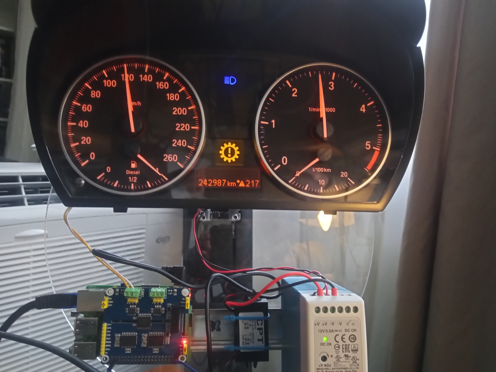

What's this?
===
I repurposed an old BMW instrument cluster as a clock. The vehicle speed represents the current hour in 24h format and RPM the current minutes. 
Between 7 and 18 o'clock sharp the hazzard lights indicate the full hour :) I tried to use the fuel gauge as second indicator - but the needle is too slow.

It's a weekend project. The code isn't a good example how you should do it when doing it in larger scale. For me it's ok for this small use case.

How to use/run/whatever
===
Compile it with ```go build``` and use the ansible playbook or use it as a template for your manual steps.

Problems
========
I had to remove the jumper for the 150 ohm resistor to get it working. With the cmdline.txt provided by waveshare can0 was in reality was can1 on the pcb.
You could easily fix it in the cmdline but after it was working I was too lazy and didn't bother

Regarding wiring use google "e90 pinout" or at the images provided here: https://forum.arduino.cc/index.php?topic=701002.0 

With increasing speed the speed needle isn't exact. So I've implemented an offset(maybe device dependant)

I wasn't able to remove all warnings especial the service error or the SOS call error.

Pics
====
I'm lazy - just one photo :)




Ansible
=======
```
ansible-playbook -i 192.168.2.31, setup.yml -e "wlanSSID=wlan-ssid" -e "wlanPassword=asdfasdf"
```

Used ressources
===============

* https://www.waveshare.com/2-ch-can-hat.htm
* https://www.waveshare.com/wiki/2-CH_CAN_HAT
* https://github.com/Marcin648/e90-dashboard-ets2
* http://www.loopybunny.co.uk/CarPC/filter.php?filter=flag_KCAN1
* https://forum.arduino.cc/index.php?topic=701002.0